<p align="center">
  
  
  
  
  
  <a href="https://vercel.com/new/clone?repository-url=https://github.com/s24b/Cogni"></a>
</p>

<br />

Cogni decides what to study, when to study, and how — so you just show up. Upload your syllabi once. It extracts your topics, maps your professor's grading weights, tracks your mastery across every topic, and generates a prioritized study plan every morning. The tutor knows where you're weakest and routes there automatically. Flashcards are scheduled by FSRS at the card and topic level. Study blocks land in your Google Calendar. All you do is study. BYOK, self-hosted on Vercel + Supabase.

<br />

## How it works

1. **Upload a syllabus** — Claude extracts topics with professor weights, exam dates, and grade breakdowns. Your course is fully mapped in minutes.
2. **Every morning, a plan is generated** — the scheduler scores every topic by mastery deficit, professor weight, and exam proximity. It allocates your session time, orders your flashcard review, and writes study blocks to Google Calendar.
3. **Open the app and study** — flashcard review, tutor sessions, and quizzes all update your mastery in real time. Tomorrow's plan adapts to what you did today.

You don't decide what to study. Cogni does.

<br />

## 📸 Screenshots

<table>
  <tr>
    <td>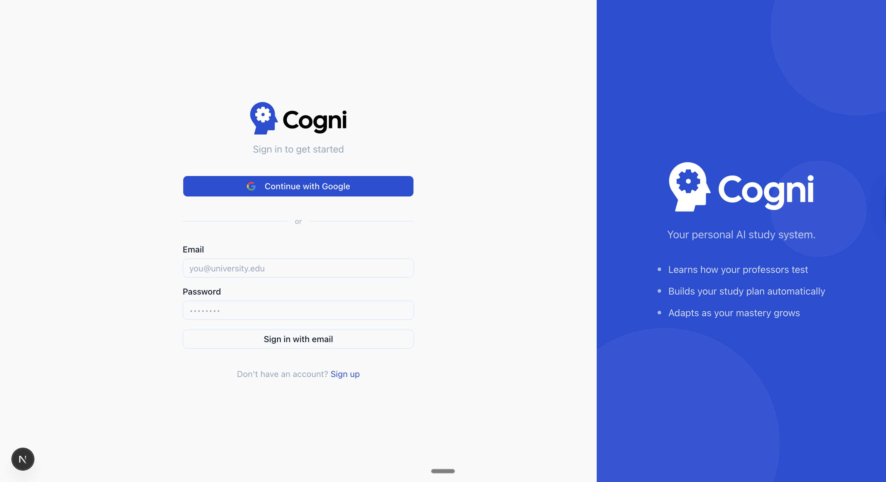</td>
    <td>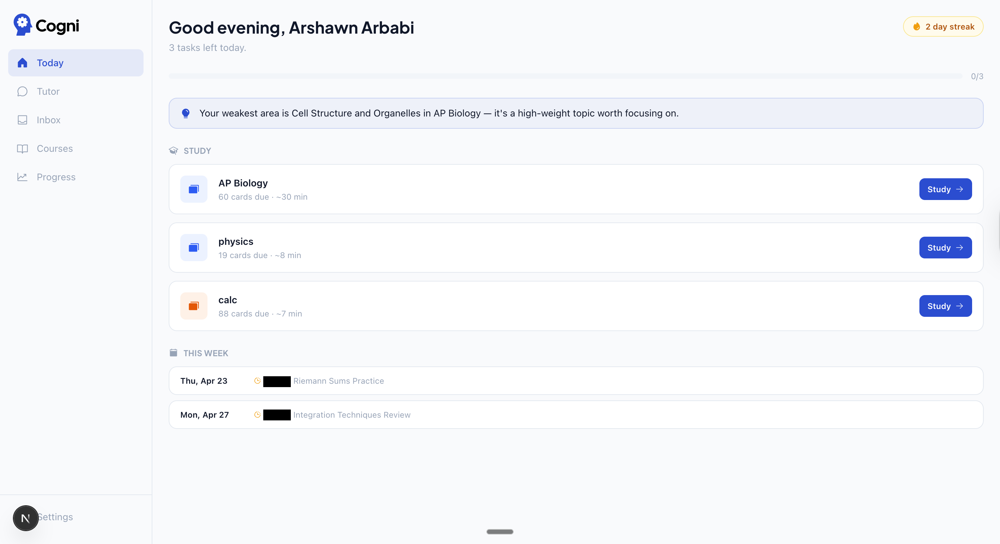</td>
  </tr>
  <tr>
    <td><b>Sign in</b> — Google OAuth or email/password</td>
    <td><b>Today</b> — AI-generated daily plan with streak, insight, and study tasks</td>
  </tr>
  <tr>
    <td>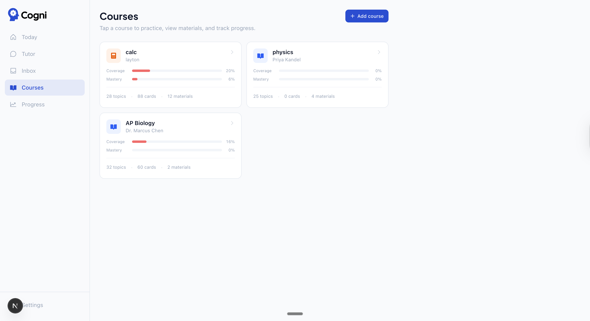</td>
    <td>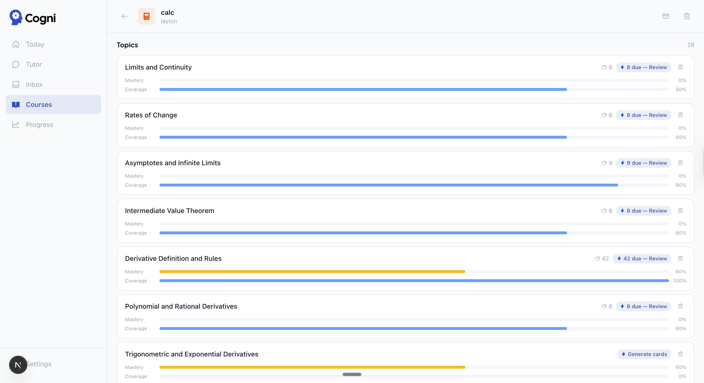</td>
  </tr>
  <tr>
    <td><b>Courses</b> — coverage and mastery bars per course</td>
    <td><b>Topics</b> — per-topic mastery, coverage, and due card count</td>
  </tr>
  <tr>
    <td>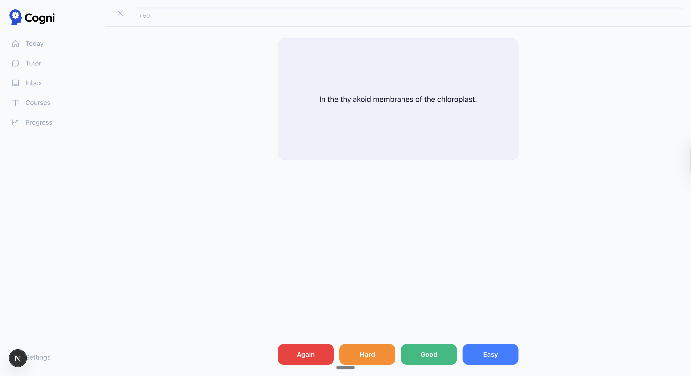</td>
    <td>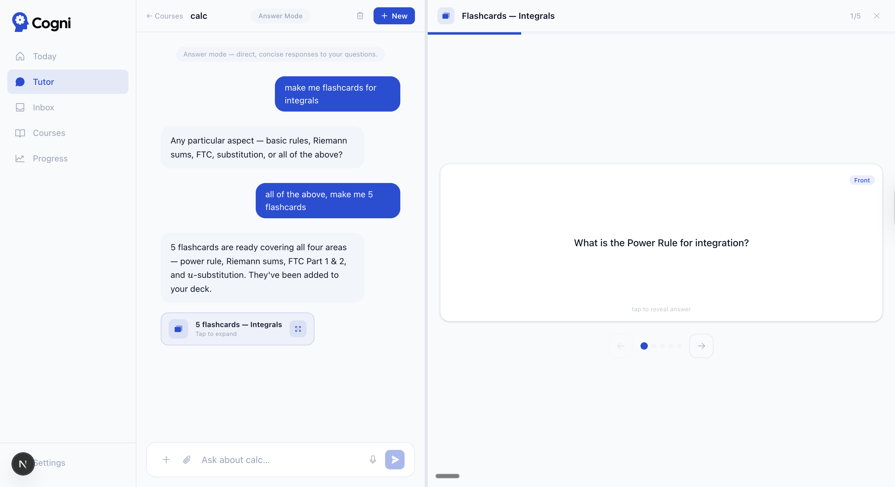</td>
  </tr>
  <tr>
    <td><b>Flashcard review</b> — FSRS 4-point rating (Again / Hard / Good / Easy)</td>
    <td><b>Tutor → flashcards</b> — inline card generation during a session</td>
  </tr>
  <tr>
    <td>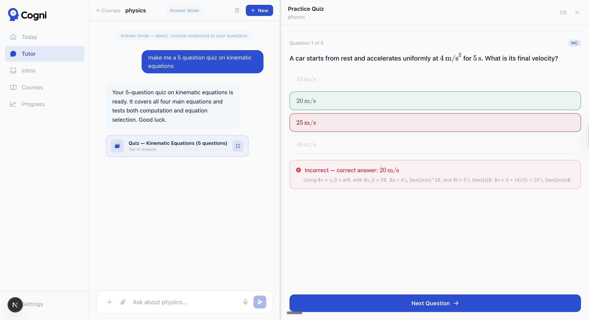</td>
    <td>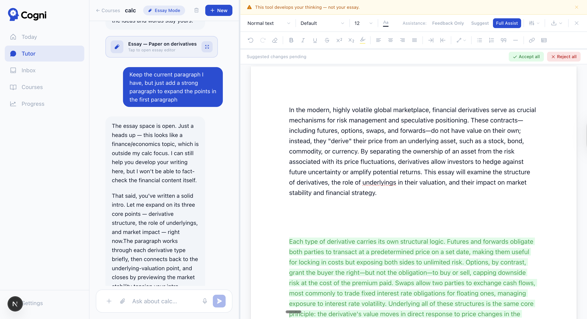</td>
  </tr>
  <tr>
    <td><b>Tutor → quiz</b> — MC with LaTeX rendering and auto-grading</td>
    <td><b>Essay mode</b> — split-view editor with tracked changes and three assist levels</td>
  </tr>
  <tr>
    <td>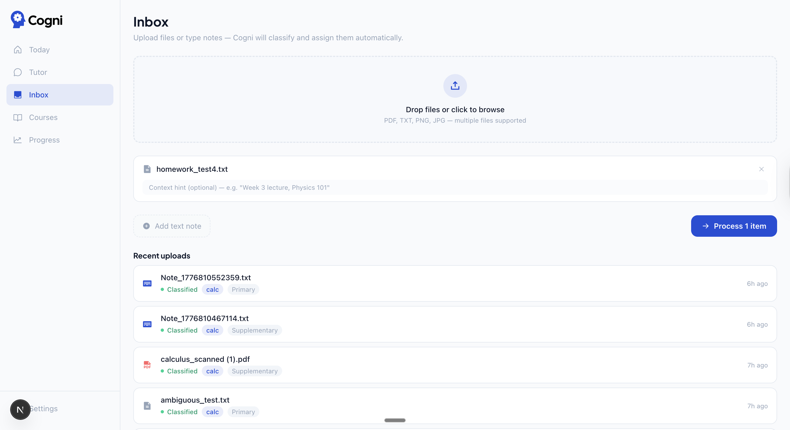</td>
    <td>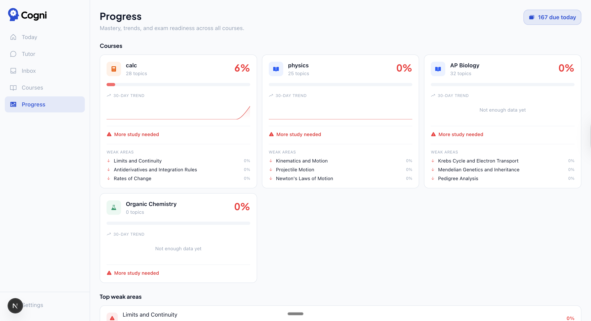</td>
  </tr>
  <tr>
    <td><b>Inbox</b> — upload files, Haiku classifies and routes them automatically</td>
    <td><b>Progress</b> — 30-day mastery trends and weak areas across all courses</td>
  </tr>
  <tr>
    <td>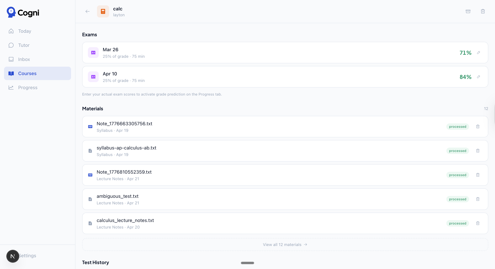</td>
    <td>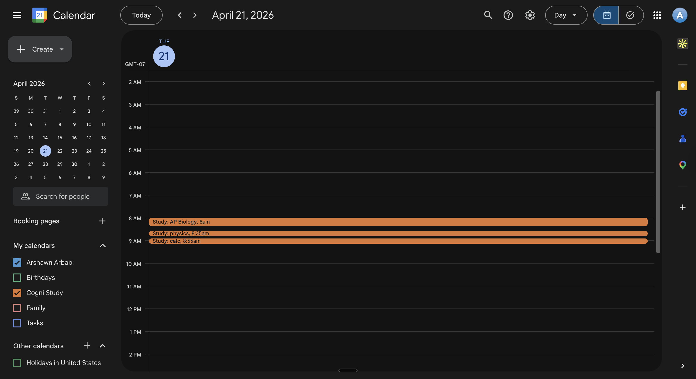</td>
  </tr>
  <tr>
    <td><b>Exams + materials</b> — scores, processed materials, test history</td>
    <td><b>Calendar</b> — study blocks written to a dedicated Cogni Study calendar</td>
  </tr>
  <tr>
    <td colspan="2">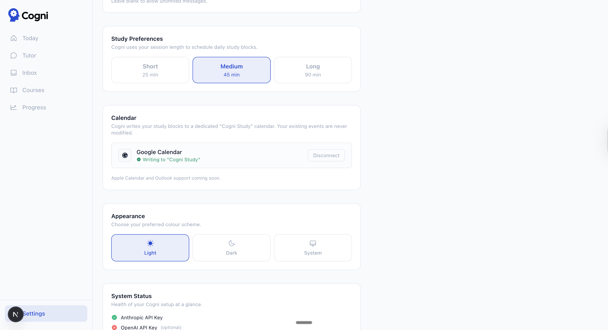</td>
  </tr>
  <tr>
    <td colspan="2"><b>Settings</b> — BYOK key status, calendar connection, session length, daily message limit</td>
  </tr>
</table>

<br />

## 🧠 Features

- **FSRS spaced repetition** — full card-level state (stability, difficulty, reps, lapses). 4-point ratings: Again / Hard / Good / Easy. Atomic RPC updates FSRS state and topic mastery in one transaction.
- **AI study planner** — daily plan prioritized by mastery deficit × professor weight × exam proximity. Generates a 6-day ahead preview. Writes flashcard review blocks to Google Calendar.
- **Claude-powered tutor** — four modes: Answer (direct), Teach (Socratic), Focus (weak-area routing), Essay (split-view editor with tracked changes). Native web search. Inline flashcard and quiz generation. Session persistence with auto-naming.
- **Syllabus profiler** — upload a PDF, Claude extracts topics with professor weights, exam dates, and grade breakdowns. RAG-enriched before extraction.
- **RAG over course materials** — pgvector with OpenAI text-embedding-3-small (1536 dims). Keyword search fallback if no OpenAI key. Top-5 chunks injected into every tutor context.
- **Inbox pipeline** — upload files or notes → Haiku (+ vision) classifies tier, course, and due date → auto-triggers profiler (tier 1) and flashcard generation (tier 1–2).
- **Wiki memory** — tutor writes durable insights to per-user markdown files (`learning_profile.md`, `weak_areas.md`, `professor_*.md`). Loaded verbatim into every session — no retrieval step.
- **Practice quiz + simulated exam** — MC and short-answer, auto-graded. Simulated exam mirrors your professor's style and topic weighting using wiki context. Mastery updated on grade.
- **Audio overview** — Claude generates an audio summary per course, stored in Supabase Storage. Requires OpenAI key.
- **Google Calendar integration** — study blocks scheduled during 8am–10pm, written to a dedicated "Cogni Study" calendar.
- **BYOK** — Anthropic and OpenAI keys stored in Supabase Vault (encrypted). No AI keys in env vars.

<br />

## ⚙️ Architecture

**Two-level spaced repetition.** Each flashcard carries full FSRS state (`stability`, `difficulty`, `reps`, `lapses`, `state`, `last_review`, `next_review_date`). Topic mastery is a separate blended score updated on every review, quiz, and exam. The scheduler uses topic mastery to allocate session time; FSRS drives card-level scheduling independently.

**Atomic review RPC.** `review_card_atomic()` runs a single Postgres transaction that updates all FSRS fields on the flashcard and applies a mastery delta to `topic_mastery`. Mastery deltas: Again = −0.1, Hard = +0.02, Good = +0.08, Easy = +0.12, clamped 0–1.

**Scheduler priority formula.**
```
priority = (professor_weight − mastery_score) × professor_weight × examProximityMultiplier
```
Exam proximity multipliers: >30 days = 1×, >14 = 1.5×, >7 = 2×, >3 = 3×, ≤3 = 5×. Session minutes are allocated proportionally across courses.

**Karpathy wiki pattern.** The tutor has a `write_wiki_pattern` tool that writes markdown to per-user files in Supabase Storage. The profiler writes `professor_*.md` on every syllabus upload. All wiki files are loaded verbatim into tutor session context on every request — no vector retrieval, just direct inject.

**Streaming tutor with native web search.** Anthropic Messages API with streaming. Tools: `create_flashcards`, `create_quiz`, `open_essay_mode`, `grade_answer`, `suggest_edit`, `write_wiki_pattern`. Real-time web lookup via Anthropic's native `web_search_20250305` tool.

**RAG pipeline.** OpenAI `text-embedding-3-small` (1536 dims) stored in pgvector with an IVFFlat index. Chunks: 3200 chars, 400-char overlap, split on paragraph/sentence boundaries. Retrieval: top-5 chunks per query, course-scoped. Falls back to LIKE keyword search if no OpenAI key is present.

**Inbox classification pipeline.** Upload → Haiku (+ vision for PDFs/images) classifies tier (1 = syllabus, 2 = primary, 3 = supplementary, 4 = misc), course, homework status, and due date → triggers profiler for tier-1 materials → triggers flashcard generation for tier-1 and tier-2 materials with fewer than 5 existing cards per topic.

<br />

## 🛠️ Tech Stack

| Layer | Tech |
|-------|------|
| Framework | Next.js 16, React 19, TypeScript 5 |
| Database | Supabase (PostgreSQL + pgvector + Auth + Storage) |
| AI — reasoning | Claude Sonnet 4.6 (tutor, profiler, exams, web enrichment) |
| AI — lightweight | Claude Haiku 4.5 (flashcards, quizzes, inbox classification, session naming) |
| AI — embeddings | OpenAI text-embedding-3-small (optional; enables RAG) |
| Spaced repetition | ts-fsrs 5.3.2 |
| Styling | Tailwind CSS 4, shadcn/ui |
| Animation | Framer Motion |
| Charts | Recharts |
| Rich text | TipTap |
| Math rendering | KaTeX |
| Icons | Phosphor Icons |
| File export | @react-pdf/renderer, docx |

<br />

## 🚀 Setup / Deployment

> Setup takes ~30–45 minutes. You'll need a Supabase account and a Vercel account.

**Step 1 — Fork and deploy**

[](https://vercel.com/new/clone?repository-url=https://github.com/s24b/Cogni)

Fork the repo and deploy to Vercel, or run locally with `npm run dev`.

**Step 2 — Supabase project**

Create a new Supabase project. Run the SQL files in order using the Supabase SQL editor. See [`supabase/README.md`](supabase/README.md) for the exact file order — do not skip files or run them out of order.

**Step 3 — Environment variables**

Add these to your Vercel project settings (or `.env.local` for local dev):

| Variable | Required | Description |
|----------|----------|-------------|
| `NEXT_PUBLIC_SUPABASE_URL` | ✅ | Supabase project URL |
| `NEXT_PUBLIC_SUPABASE_ANON_KEY` | ✅ | Supabase anon key |
| `SUPABASE_SERVICE_ROLE_KEY` | ✅ | Supabase service role key |
| `NEXT_PUBLIC_APP_URL` | ✅ | Your deployment URL (e.g. `https://your-app.vercel.app`) |
| `GOOGLE_CALENDAR_CLIENT_ID` | Optional | Google Cloud Console — Calendar OAuth |
| `GOOGLE_CALENDAR_CLIENT_SECRET` | Optional | Google Cloud Console — Calendar OAuth |

Anthropic and OpenAI keys are **not** env vars. Users add them in Settings after deploying.

**Step 4 — Google OAuth**

In Supabase dashboard → Authentication → Providers → Google. Add your Google OAuth client ID and secret. Set the redirect URL to `https://your-app.vercel.app/auth/callback`.

**Step 5 — Add your Anthropic key**

After deploying, go to Settings and add your Anthropic API key. Required for all AI features. Keys are stored in Supabase Vault — never in env vars.

**Step 6 — Optional: OpenAI key**

Add an OpenAI key in Settings to enable pgvector RAG. Without it, keyword search fallback is active.

**Step 7 — Optional: Google Calendar**

Connect Google Calendar in Settings → Calendar. Cogni will write study blocks to a dedicated "Cogni Study" calendar.

<br />

## 🔑 API Keys

**Anthropic (required)** — Powers the tutor, profiler, flashcard generation, quizzes, and inbox classification. Get a key at [console.anthropic.com](https://console.anthropic.com). Typical usage for a single student: ~$2–5/month.

**OpenAI (optional)** — Used only for `text-embedding-3-small` embeddings. Enables pgvector RAG for richer tutor context and better syllabus profiling. Without it, Cogni falls back to keyword search. Get a key at [platform.openai.com](https://platform.openai.com).

Both keys are stored in Supabase Vault (encrypted at rest). They are never written to env vars or logs.

<br />

## 💻 Local Development

```bash
git clone https://github.com/s24b/Cogni
cd Cogni
npm install
cp .env.example .env.local
# fill in .env.local with your Supabase credentials
npm run dev
```

Vercel Cron Jobs do not run locally. The scheduler runs automatically when you navigate to Today (if no plan exists for today). Nudge checks and other cron-triggered agents can be triggered manually via Settings → Dev Tools.

<br />

## 📄 License

[MIT](LICENSE) — Copyright (c) 2026 Arshawn Arbabi

<br />

## ⚠️ Active Project

Cogni is an active personal project. Some features may have rough edges — contributions and bug reports are welcome.
